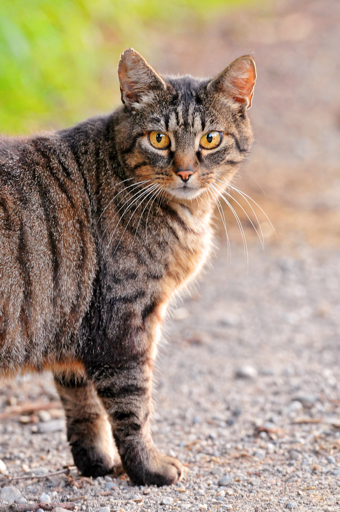

See explanation of this repo here: https://danielrapp.github.io/cat-filter/


Here's how to use it:
```html
<html>
  <head>
    <script src="https://cdn.jsdelivr.net/npm/@tensorflow/tfjs/dist/tf.min.js"></script>
    <script src="https://cdn.jsdelivr.net/npm/@tensorflow/tfjs-backend-wasm/dist/tf-backend-wasm.js"></script>
  </head>
  <body>
    
    <script src="cat-filter.js"></script>
    <script type="module">
      const model = await cat_filter.load('filters/cat_heart_eyes');
      const img = document.getElementById('my-cat');

      cat_filter.apply(img, model);
    </script>
  </body>
</html>
```

Additionally you can do setup separately like this. This also gives you the opportunity to choose which bounding box and face landmarks model to use. For both the bounding box and landmark models you have an option of `uint8` and `uint16` and for the landmarks model you also have an `f32` option. These trade between computation speed and accuracy, with `uint8` being the fastest and `f32` the most accurate, and `uint16` lying somewhere in between.
```javascript
await cat_filter.setup({ bounding_box_model_path: 'cat_box_uint16', landmarks_model_path: 'cat_landmarks_uint16' });
const model = await cat_filter.load('filters/cat_heart_eyes');
```
